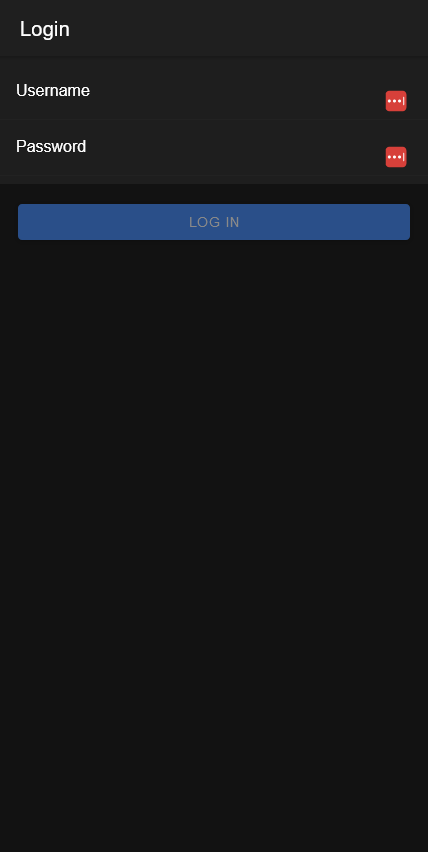
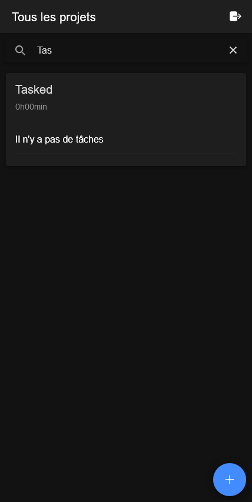
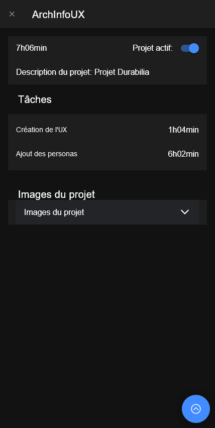
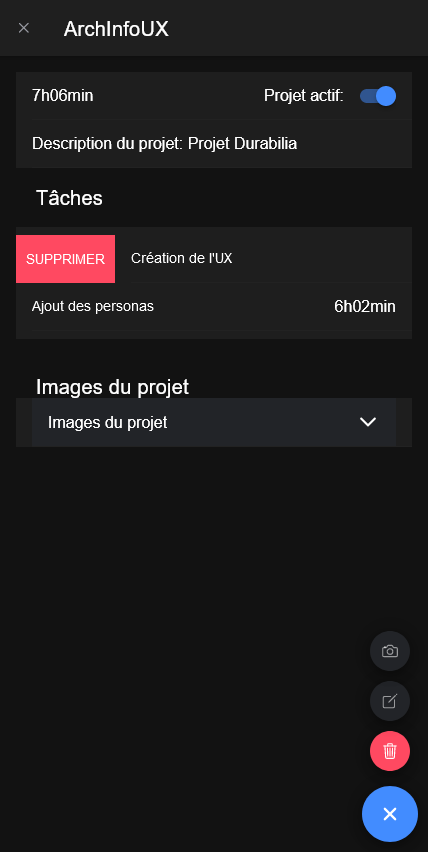
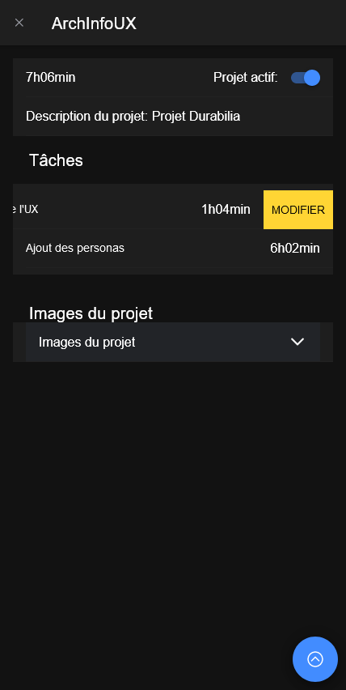
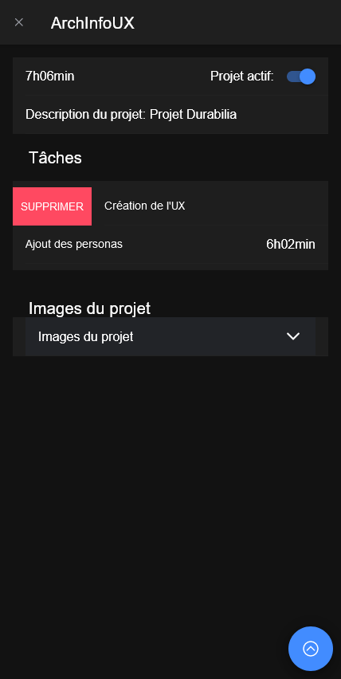
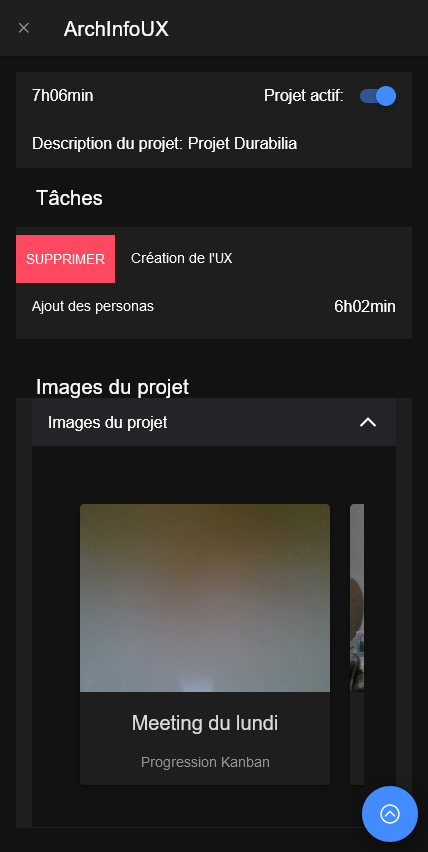

# Tasked App 


# Installation
## Prérequis

    - Node.js 18.10+
    - Un token d'API qimg
    - Un accès à l'API tasked (tasked.onrender.com)
    - Un accès à un nom d'utilisateur existant

1. Cloner et pull le repository
    ```
    git pull
    ```
2. Installer les packages
    ```
    npm i
    ```
3. Rendez-vous dans le dossier `/src/environments` et renommez le fichier `environment.sample.ts` en `environment.ts`. Modifiez ensuite les valeurs à l'interieur du fichier avec des token d'API et des URL valides.
4. Exécuter l'application
    ```
    ionic serve
    ```

# Projet
Voici l'application de gestion du temps ultime pour votre appareil mobile ! Avec notre application, vous pouvez facilement créer et organiser des tâches au sein de projets, et suivre le temps passé sur chaque tâche.

# Caractéristiques

 - Créez et gérez des projets, avec des tâches et des descriptions de tâches.
 - Ajoutez des tâches en indiquant le timing
 - Prenez et joignez des photos aux projets pour ajouter du contexte
 - Affichez une liste de tous vos projets et passez facilement de l'un à l'autre.
 - Gagnez du temps et augmentez votre productivité grâce à notre interface conviviale et à nos puissantes fonctionnalités de gestion des tâches.

Que vous soyez un professionnel occupé, un étudiant ou que vous cherchiez simplement à rester organisé, notre application est la solution parfaite pour tous vos besoins en matière de gestion du temps. Téléchargez maintenant et commencez à augmenter votre productivité dès aujourd'hui !

# Fonctionnement

## Connexion
En premier, il faut se connecter.



## Projets
La première page permet de voir tous les projets!


Vous pouvez très facilement rechercher parmi tous les projets au travers de la barre de recherche !



N'oubliez pas, depuis la page projets, vous pouvez toujours actualiser swipant vers le bas.

## Voir un projet
En cliquant sur un projet, vous voyez les informations complètes de ce dernier, avec: 
 - les tâches en lien
 - les images du projet




En cliquant sur la flèche en bas de l'écran, depuis les projets, vous pourrez modifier le projet, rajouter une image ou supprimer le projet !



### Manipulation des tâches
Si vous voulez modifier une tâche, il faut simplement glisser la tâche vers la gauche.



Pour supprimer une tâche, c'est la même chose, il suffit de glisser vers la droite.



### Les images
Lorsque vous déroulez les images, vous pouvez les voir en accordéon. Il est possible de les modifier simplement en cliquant sur l'image de votre choix !



# Informations
Ce projet a été développé dans le cadre d'un cours à l'HEIG-VD à Yverdon-les-Bains (CH). Il s'agit d'un projet fictif.

## Auteurs
Emile Vianney-Liaud
Sylvain Salgat
Eliott Piaget

